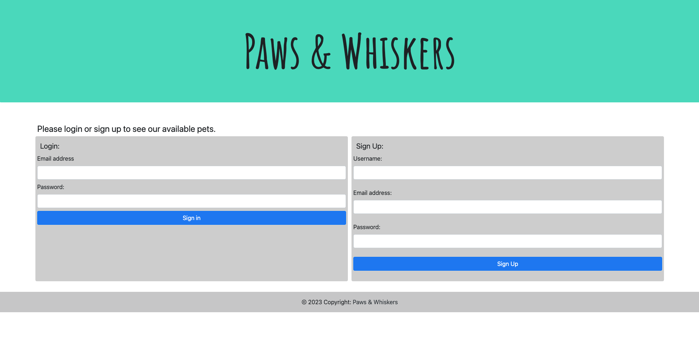
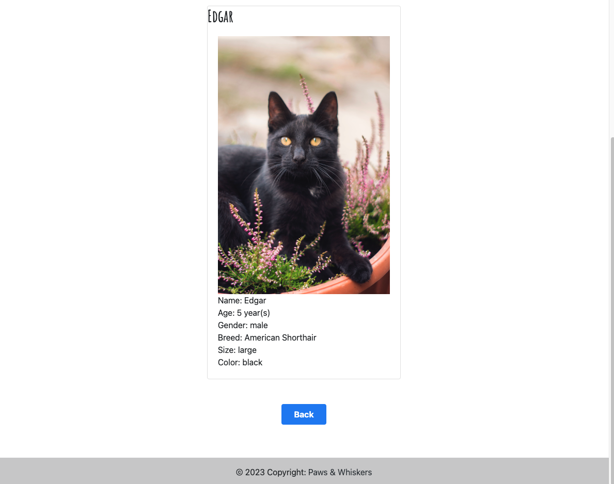
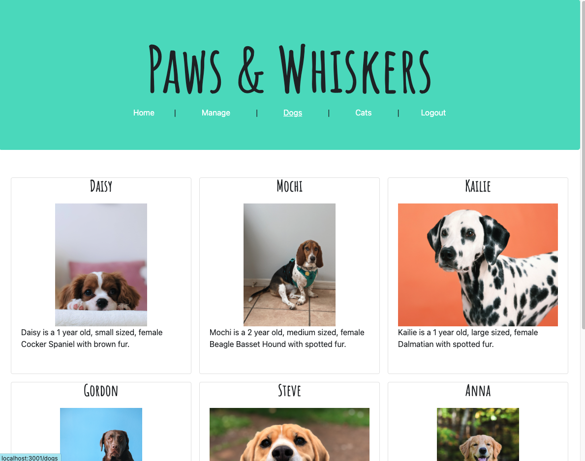
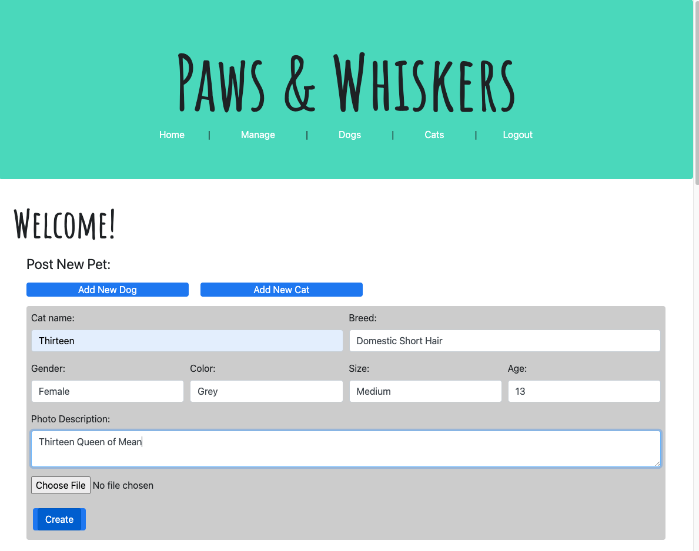
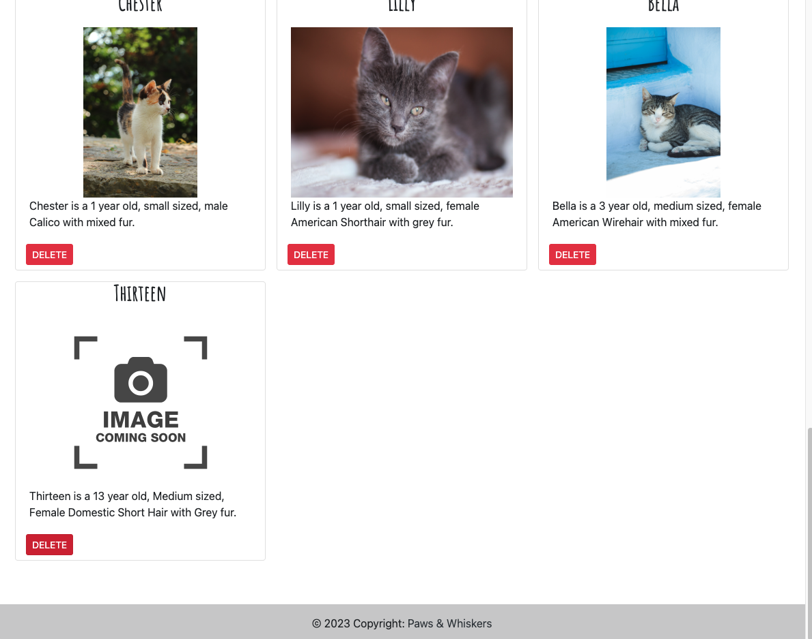
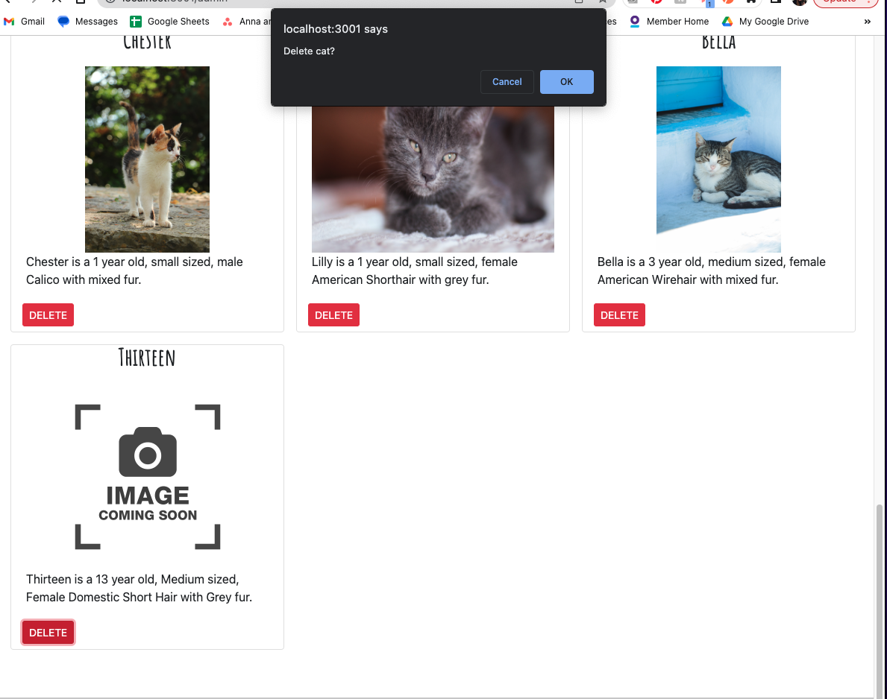

# Paws and Whiskers

  ## Badges
  

  ## Description
  🔮 This application serves as a pet adoption website for prospective pet owners to browse available cats and dogs.  We wanted to provide an interactive application for users to view a gallery of all pets, view by only cats and only dogs, and a single detailed view of each pet. 

  ### Elevator Pitch 
  Our team can offer your nonprofit organization a clean looking website that showcases the dogs or cats you have up for adoption. Your clients will be able to get the information they need on your available pets as well as see a picture of their newest furry friend. Your staff will easily be able to add new pets to the website as your shelter continues to do the wonderful work of rescuing these pets.

  ### User Story
    AS A pet shelter owner
    I WANT to be able to upload cats and dogs in need of homes and delete adopted pets
    SO THAT prospective pet owners can chose a pet to adopt.

  ## 📚 Table of Contents
  * [🔧 Installation](#installation)
  * [🎢 Usage](#usage)
  * [🚧 Contribution](#contribution)
  * [🔑 License](#license)
  * [❓ Questions](#questions)
  
  ## Technologies Used
  🔧 JavaScript ES6+, CSS3, HTML5, SQL, MySQL2, Express, Node, Handlebars, Tailwinds, Bootstrap, Sequelize, API

  ## Usage 
  🎢 See screenshots below:
  
  Landing page - Login or Sign Up via forms
  
  Home Nav Link - View all pets
  
  Click on Individual Pet - View single cat or dog; Go back to homepage
  
  Dogs Nav Link - View only dogs
  
  Cats Nav Link - View only cats
  
  Manage Nav Link - Add pets via Post New Pet Forms or Delete pets via Delete button
  
  New pet added to database with Coming Soon Image
  
  Confirm Delete prompt to delete from database
  

  ## Future Development
  - Filter: We would like to add a filter option to refine the available pets by size, age, and breed.
  - Photo Uploader and Data: We would like to add the pet photos via image uploader and add to the database instead of housed in the file structure. 
  - Auth: We would like to add auth helper for admin permissions to post/delete.
  - Chat: We would like to provide a live chat for consultation.
  - UX/UI: We would like to further improve the UX/UI design.
 

  ## Contribution 
  🚧 Group 6:
  * Maggie Messer: [Maggie's GitHub](https://github.com/magmesser)
  * Eliot Crandall: [Eliot's GitHub](https://github.com/ejc10d)
  * Jean Santiago: [Jean's GitHub](https://github.com/JM-Santi)
  * Nicole Fallis: [Nicole's GitHub](https://github.com/nfallis96)

  ## License
  🔑 This application is covered under the MIT license.    
      Find out more here: https://choosealicense.com/licenses/mit/  
      

  ## Questions
  ✨ Deployed Application Link: https://pawsandwhiskers.herokuapp.com/  
  ❗ Repository Link: https://github.com/magmesser/pawsandwhiskers  
  🎥 Project Presentation Link: [Google Slides Presentation](https://docs.google.com/presentation/d/1T7SAOd17-8rQUoKQ_bwX_KuRDbLOa7Ceiz6Wcdry1f0/edit?usp=sharing)
